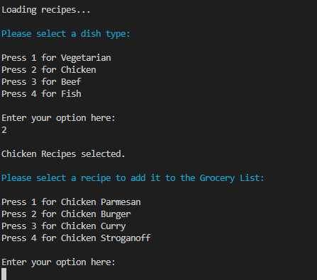
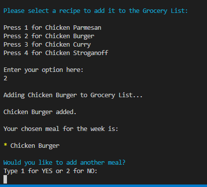
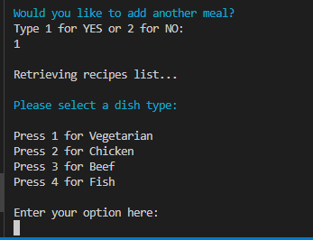
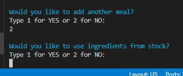

# EasyGrocery Project

In this project, I tried to create a grocery list generator using Python and google sheets as a database. The user can choose from a selection of recipes, and the program will generate a grocery list with all the necessary ingredients based on the user’s choices. The program also gives the user the option to check the stock before generating the list, making figuring out what ingredients you should buy and what you already have in inventory a lot easier.

You can find a live version of the program [here.](https://easy-grocery-marcellomuy.herokuapp.com/)

## Table of contents
1. [Plans and structure](#plans-and-structure)
    - [Flowchart](#flowchart)
    - [Objectives](#objectives)
	- [Changes throughout the process](#changes-throughout-the-process)
2. [Color scheme](#color-scheme)
3. [Features](#features)
    - [Welcome page](#welcome-page)
    - [Instructions](#instructions)
    - [Picking a dish type](#picking-a-dish-type)
    - [Picking a recipe](#picking-a-recipe)   
    - [Adding a recipe](#adding-a-recipe) 
    - [Using the stock](#using-the-stock) 
    - [Grocery list using stock](#Grocery-list-using-stock)
    - [Grocery list without any changes](#Grocery-list-without-any-changes)
    - [See stock](#see-stock)
4. [Testing](#testing)
    - [Python](#python)
    - [Manual Testing](#manual-testing)
5. [Deployment](#deployment)
6. [Credits](#credits)

    ## Plans and structure   

### Flowchart:

### Objectives:

- I want to create a program that is easy to navigate.
    - Was this achieved?
        - Yes
    - How was this achieved?
        - By using numbers as the option choices. The user can choose between 1 and 2 for YES or NO questions and between 1 and 4 for dish types and dish recipes questions.
- I want the program to display the recipes by category.
    - Was this achieved?
        - Yes
    - How was this achieved?
        - By creating a list with the names of the recipes for each dish type in the database. These lists can be accessed separately and have the names of the recipes extracted from them.
- I want the program to run in a loop asking the user if they want to add another meal.
    - Was this achieved?
        - Yes
    - How was this achieved?
        - After picking a meal, the program will ask the user if they want to add another meal, 1 for YES or 2 for NO. If the user types 1, it will go back to the dish type selection screen. If the user types 2, it will finish the recipes selection phase.
- I want the program to display on-screen the picked recipes when asking the user to add another meal.
    - Was this achieved?
        - Yes
    - How was this achieved?
        - By placing a print statement that displays the recipes list inside the while True loop in the another_meal() function that handles this part of the code.
- I want the program to give the user the option to have the complete grocery list or have an updated list with the ingredients in stock removed from it.
    - Was this achieved?
        - Yes
    - How was this achieved?
        - After selecting meals, the program will ask if the user wants to check the stock before generating a grocery list, 1 for YES or 2 for NO. If 1, is selected the program will compare the complete grocery list against the ingredients in stock and generate the updated list. If 2, is selected a complete grocery list with no adjustments will be generated.
- I want the program to display to the user what is in stock.
    - Was this achieved?
        - Yes
    - How was this achieved?
        - By creating a function that gets all the stock information from the database and displays it to the user.

### Changes throughout the process:

- The project was divided into two phases.
The first phase was implemented now, and the second phase can be implemented in the future.

- Initially, I had the idea to create a program that would have the stock database updated after an ingredient is used for a recipe. Due to the limit of time and security reasons, I decided to keep the database read-only.

- I had plans to give the user the option to add new recipes, but this function was also pushed to the second phase due to the reasons above.

Go back to [Table of contents](#table-of-contents)

## Color scheme

I decided to add a color scheme to provide a better user experience:

- Program name is displayed in Green with the style Bright.

- Invalid data error messages are displayed in red.

- Questions are displayed in Cyan.

- Tables are displayed in Yellow.

Go back to [Table of contents](#table-of-contents)

## Features

### Welcome page

- This is the first page will see when you load the program. On this page, there is a welcome message and a question to the user. The question asks the user if they want to see the instructions, yes or no.

### Instructions 

- The instructions page explains to the user how the program works and then asks the user if they want to pick a meal or see the stock.

### Picking a dish type

- The user can choose between 4 dish types on this screen and is asked to type a number between 1 and 4.

### Picking a recipe

- The user can choose between 4 recipes on this screen and is asked to type a number between 1 and 4.

### Adding a recipe

- On this page, the user can see recipes already added to the list and is asked if they want to add another. 
- If the user type 1 for yes, the program will loop back to the dish type menu. 

### Using the stock

- When the user is done adding meals, the program will ask if they want to use the ingredients from stock.

### Grocery list using stock

- If the user chooses to use the ingredients from stock, the program will remove the ingredients in stock before generating the grocery list.

- A thank you message is displayed, and the option to rerun the program is given.

- If the user decides to rerun the program, it will display the welcoming page again.

### Grocery list without any changes

- If the user decides not to use the ingredients from stock, a grocery list with all the ingredients necessary for the recipes is generated.

- A thank you message is displayed, and the option to rerun the program is given.

### See stock

- If the user decides to see the stock, a table is displayed showing all the ingredients in stock.

- The user is then asked if they want to pick the meals or to restart the program.

- If one is pressed, the dish type pages will load.

- If two is pressed, the welcoming page will load.

Go back to [Table of contents](#table-of-contents)

## Testing

### Python

Python was tested using PEP8 [PEP8 validator](http://pep8online.com/) 

The Python results came back with the following:

- 5x line too long 

- To fix this, I edited the lines into two shorter lines or declared a variable with the more extended info and added the variable to the original line.
    
    - Here is an example of how it was done.
    
     

- I then retested with PEP8 and it came back clear:

 

### Manual testing

All results happened as expected. Below you can see the result obtained after each attempt. 

1. Instructions
    
- If the user types anything other than 1 or 2:

 
    
- If the user types 1:

 

- If the user types 2:

 

2. Selecting between picking a meal or seeing the stock:

- If the user types anything other than 1 or 2:

 

- If the user types 1:

 

- If the user types 2:

 

3. Selecting a dish type:

- All options were tested, including for input other than 1, 2, 3, and 4.

- Option 1:

- Option 2:

- Option 3:

- Option 4:

- Wrong input:

4. Selecting recipe:

- All recipes were tested, including for input other than 1, 2, 3, and 4.

- Vegetarian recipes:

- Chicken recipes:

- Beef recipes:

- Fish recipes:

5. Adding another meal:

- Option 1 and 2 tested.

- Input other than 1 and 2 tested.

6. Using the stock:

- Option 1 and option 2 were tested using the same recipe. 
- As you can see, when check stock was selected, the ingredient broccoli was removed from the list.

- Input other than 1 and 2 tested.

Go back to [Table of contents](#table-of-contents)

## Deployment 

There were many steps to deploying this project to Heroku:

1. If I had installed any packages to Gitpod, I would need to add then to a list of requirements. 
- To do this I would have typed pip3 freeze > requirements.txt and hit enter, this would update the requirements.txt file.
- I'd need to commit and push this to Github.
- Heroku will use this list to install the dependencies into the application before the project is run.
2. I went over to my Heroku dashboard and clicked on 'create a new app'.
3. I chose a name for my program.
4. Selected my region and clicked create app. 
5. I then went to the tab at the top of the page and clicked on settings. 
6. My program include sensitive data used to access google sheets that isn't in the github repository because it has been deliberately protected in the gitnore.file. 
 - To do this, I had to click reveal config vars.
 - Fill in the key: CREDS
 - Then copy and pasted the contents of 'CREDS' file into the value field and clicked add. 
7. I added the buildpacks needed by clicking on the buildpack button.
 - Here I selected python and pressed save changes.
 - Then repeated the same process but selected nodejs this time.
 - making sure it was done in that order with python at the top and nodejs under.
8. I scrolled back up to the tab at the top and clicked deploy.
9. I selected github as the deployment method and clicked connect to github.
10. Once this is selected, I then searched for my github repository name, and connected to the correct repository.
11. Then I scrolled down, here there were two options.
 - The first option being to enable automatic deployment, which means that Heroku will rebuild the app every time I pushed a change to github.
 - The other option being to manually deploy, which is the choice I went for with this project.
12. When all the code is received from github there is a view button that it a link to the running app, I clicked this to make sure everything was running as expected.

Go back to [Table of contents](#table-of-contents)

## Credits 

- [Lucid chart](https://www.lucidchart.com/pages/) - This was used to my flowchart. 
- [PEP8 validator](http://pep8online.com/) - was used to check the code was valid.
- [Stack Overflow](https://stackoverflow.com/) - was used several times in order to complete this project.
- My mentor Marcel who helped me through this project.

Go back to [Table of contents](#table-of-contents)